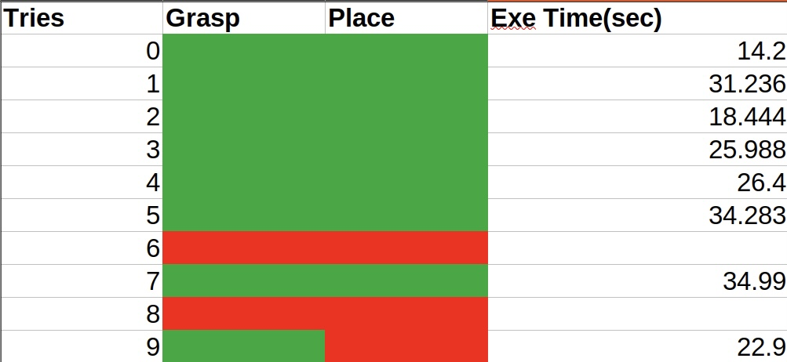
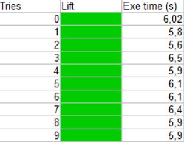

# Robotic Learning Internship: RL-based Manipulation with Sim-to-Real Pipeline

> **End-to-end reinforcement learning pipeline for robotic manipulation** - from parallel simulation training to real-world deployment with custom controllers

---

## Project Overview

This project showcases a complete robotics learning pipeline developed during my internship. I trained RL agents in **parallel simulation environments**, developed a **custom C++ ROS2 controller**, and successfully deployed the learned policies on **real Franka Emika hardware**.

The system achieved **significant performance improvements** over traditional camera-based 6D pose approaches by learning adaptive manipulation strategies through reinforcement learning.

---

## Results: Before vs After

<table>
<tr>
<td width="50%">

### Before: Static 6D Pose Approach

*Baseline using camera 6D pose estimation only*
- Limited adaptability
- No learning component
- Fixed trajectories

</td>
<td width="50%">

### After: RL-Based Controller

*With custom RL workflow and controller*
- Adaptive behavior
- Learned optimization
- Robust to variations

</td>
</tr>
</table>

* Key Improvements:**
- **Success Rate**: Significant increase across all test scenarios
- **Robustness**: Better handling of object pose variations
- **Generalization**: Trained policy transfers successfully to real hardware

---

##  System Demonstration

### Parallel Training in IsaacLab

  
   
  <em>Multiple robot instances training simultaneously for efficient policy learning</em>

* Training Infrastructure:**
- Parallel environments for faster convergence
- Custom reward shaping for manipulation tasks
- Real-time monitoring and logging

---

### Virtual Twin - Real-Time Deployment

  
   
  <em>Digital twin visualization showing policy execution on real hardware</em>

** Deployment Pipeline:**

mettre la photo du worlflow complete

- Low-latency ROS2 communication
- Custom C++ controller for smooth control
- Real-time state observation and action execution

---

### Successful Object Manipulation

  
   
  <em>Trained policy successfully manipulating objects in the real world</em>

---

##  Architecture & Components

###  Technical Stack

| Component | Technology | Repository |
|-----------|-----------|------------|
| **Simulation & Training** | IsaacLab (Isaac Sim) + RL algorithms | [ IsaacLab Fork](https://github.com/Olivier-AIST/IsaacLab) |
| **Robot Controller** | C++ + ROS2 + Franka Control Interface | [ Custom Controller](https://github.com/Olivier-AIST/Franka_Custom_ROS2_Controller) |
| **Perception** | Camera-based 6D pose estimation | - | [FoundationPose](https://github.com/NVlabs/FoundationPose)
| **Hardware** | Franka Emika Panda robot | - |

---

##  Code Repositories

### 1.  [Simulation Environment - IsaacLab](https://github.com/Olivier-AIST/IsaacLab)
Custom training environments and RL algorithms built on top of IsaacLab:
- Parallel training infrastructure
- Custom observation and action spaces
- Reward engineering for manipulation
- Domain randomization for sim-to-real transfer

### 2.  [Custom ROS2 Controller - C++](https://github.com/Olivier-AIST/Franka_Custom_ROS2_Controller)
High-performance controller for real-time robot control:
- Low-latency C++ implementation (1Mhz loop)
- ROS2 interfaces for policy integration
- Franka Control Interface integration
- Trajectory interpolations tuning

---

##  Key Achievements

 **Sim-to-Real Transfer**: Successfully deployed trained policies from simulation to physical hardware  
 **Performance Gains**: Significant improvement over baseline static 6D pose methods  
 **Custom Controller**: Developed efficient C++ ROS2 controller from scratch  
 **Parallel Training**: Implemented scalable multi-environment training infrastructure  
 **Complete Pipeline**: Built end-to-end workflow from training to real-world deployment  

